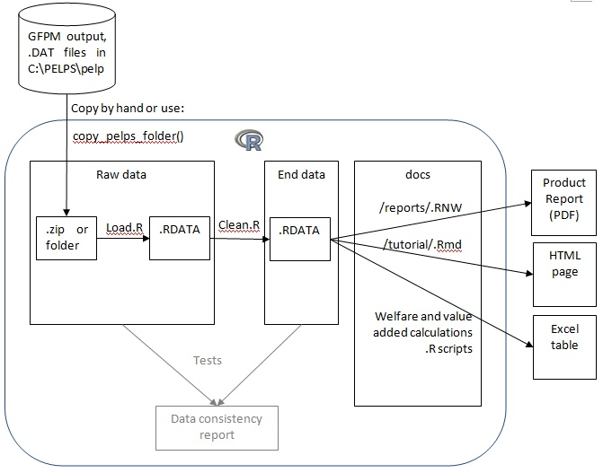

This program reads output simulation of the __Global Forest Product Model (GFPM)__. 
The system converts raw GFPM output (text files .DAT) into dataframes. So that you can avoid using Excel macros to display GFPM simulations. Based on the converted data, several reports can be generated in the form of html, pdf or Excel documents. It can be used to plot consumption, production and trade volumes for more than 2 scenarios and to automate various calculations such as welfare and value added.


__Software components__:
You will need to install the GFPM and the R statisticall software. Links to the software components:
* The GFPM model and its user manuals are available on [this page of the University of Wisconsin-Madison](http://labs.russell.wisc.edu/buongiorno/welcome/gfpm/).
* The [R statistical software](http://www.r-project.org/)
* A text editor, we have used [R-Studio](http://www.rstudio.com/products/rstudio/download/)
* You may need to install [Rtools](http://cran.r-project.org/bin/windows/Rtools/), so that some file compression becomes available.
* Command to install R packages:
```
install.packages(c("plyr", "ggplot2"))
```


__Data sources__: Data files are imported in the form of text files, named .DAT, see "input data" below.

__Authors__: Paul Rougieux and Ahmed Barkaoui

__Institution__: European Forest Institute and INRA 

__License__: This package is free and open source software, 
licensed under the [GNU GPL](http://www.gnu.org/copyleft/gpl.html).


Tutorial
----------
After a GFPM scenario has been run, simulation results are stored 
in plain text format in the `C:\PELPS\PELPS` folder. 
* How to load and prepare GFPM data: 
   [load_clean.md](./docs/tutorial/load_clean.md) (github) or [load_clean.html](./docs/tutorial/load_clean.html) (local link).
* How to visualise the content of a dataset [explore.md](./docs/tutorial/explore.md) (github) or [explore.html](./docs/tutorial/explore.html) ) (local link)
* The `./docs` folder contains summary statistics, explanatory graphs and calculations


The figure below illustrates the workflow. 




Tests
-----
To run all tests, use the command:
```
library(testthat)
test_dir("tests")
```
As of January 2014 system.time() tells that all tests take less than 3 seconds to run.

Code 
-----
The R program is composed of 3 scripts in the ./code folder:
* Load.r
* clear.r
* func.r
Scripts can be run in this order.

Other folders contain data and output documents
* /rawdata
* /enddata
* /Docs folder where output graphs are produced
using Knitr, a program that enables to embedd R code in Latex documents.


Git 
---
Git is a version control program used to track different versions of the code. Example Git commands:
```
git status
git add --all
git remote -v # Display remote backup server
```
In order to ignore bulky files, a .gitignore file is placed in the ./rawdata folder:
```
*
!.gitignore
```

Comments and suggested improvements
--------------------------------
* Change `=` assignments to `<-`

### Copying from  "C:\PELPS\PELPS"
Write a function to copy files from "C:\PELPS\PELPS" to a .zip archive in the "./rawdata" folder.
copyfromPELPS("my_scenario_name"). Then write a wrapper function that copies, loads and cleans the scenario: copyAndCleanPELPSdata("New scenario Name"). I could use the functions file.copy, file.rename, zip and the home made functions in load.r and clean.r for this task.

### Folder compression
Use bzip2 to compress files. This utility is available on windows in the git bash shell.
Bzip compressed files can then be read from R using the Functions to Manipulate Connections such as bzfile.

A function can handle several scenario archive formats: folder, zip. 
zip format is for usual zipped folder on windows, where zip archive contains a subfolder with the same name and then the files.
data = read.table(unz("RawData/PELPS 105Base.zip", "PELPS 105Base/DEMAND.DAT"))

zip files are not automatically closed after I've read the data. I get:
```
Warning message:
closing unused connection 3 (RawData/PELPS 105 TFTA Low scenario revision 1.zip:PELPS 105 TFTA Low scenario revision 1/DEMAND.DAT) 
```
I tried to open a connection and close it as explained in ?unz, I then get this error:
```
Error in read.table(con, header = FALSE, as.is = TRUE) : 
  seek not enabled for this connection
```

### Table of contents
Knitr creator Yihui explained [in a comment on this forum](http://stackoverflow.com/a/14664227/2641825) 
how to add a table of content to a Rmd file using the knit2html() function:
```
library(knitr)
knit2html('docs/tutorial/load_clean.Rmd', options = c('toc', markdown::markdownHTMLOptions(TRUE)))
```
See [my blog post](http://paulremote.blogspot.fr/2014/01/add-table-of-content-to-html-files.html) on 
how I followed the RSTUDIO advice to
[customize markdown rendering](http://www.rstudio.com/ide/docs/authoring/markdown_custom_rendering).

Changelog
---------
August 2013: started writing scripts to import PELPS data.

January 2014: 
* Changed load.r to enable reading from zip files. 
* Used options(run.clean.main=FALSE) to decide whether to run the main clean function or not.
  The main clean function is not called from tests. 

June-July 2014:
* Modified the tutorial to explain how load.R and clean.R work.
* Added a picture of the workflow in the readme.
