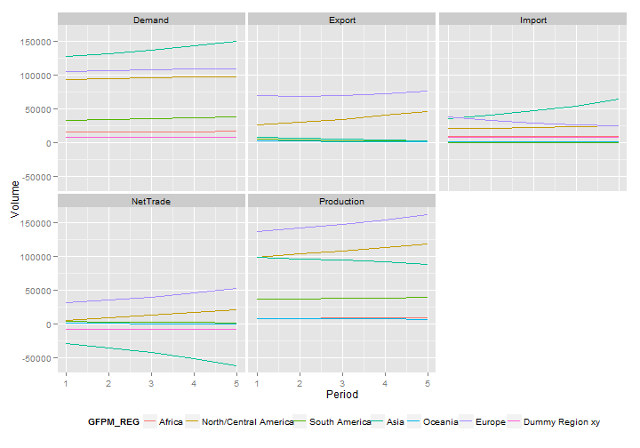
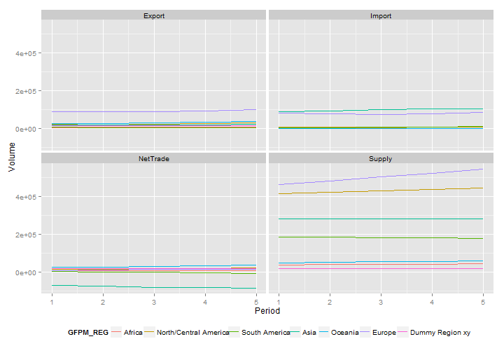
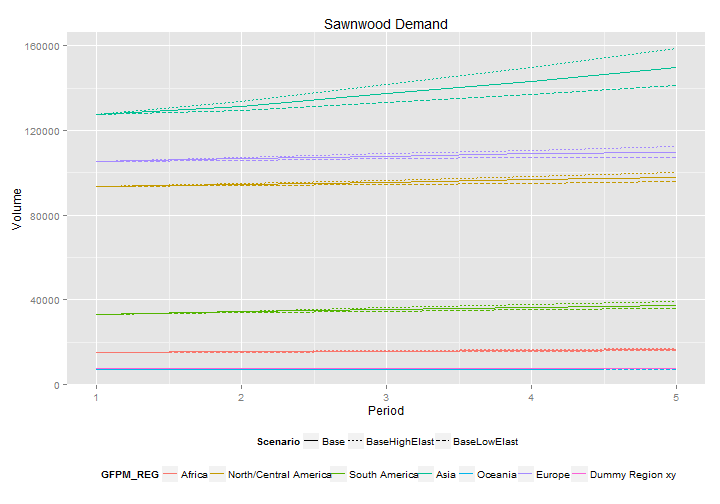
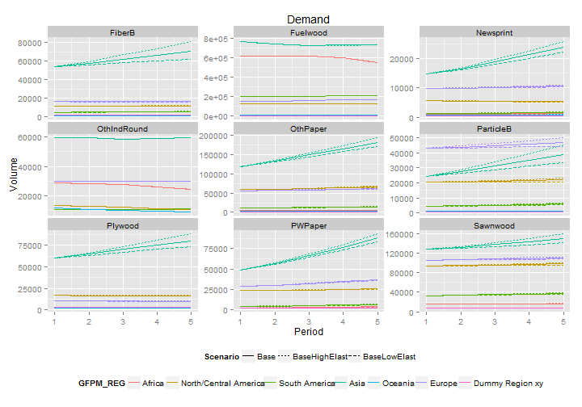

```r
library(plyr)
source("code/func.R")
```


Explore GFPM scenarios
=====================
Load scenario

```r
load("enddata/GFPM_training_scenarios.RDATA")
```


Plots
-----
### Base scenario

```r
plotProdByReg(trainingScenarios, "Sawnwood", "Base")
```

 


```r
plotProdByReg(trainingScenarios, "IndRound", "Base")
```

 


### Compare the base scenario with other scenarios
The other 2 training scenarios, where calculated by changing the demand
elasticities by plus or minus 1 standard error, corresponding to a 
confidence intereval of 70%.

```r
dtf <- subset(trainingScenarios$aggregates, Product=="Sawnwood"& Element=="Demand")
ggplot(data = dtf) +
    aes(x = Period, y = Volume, colour = GFPM_REG, linetype = Scenario) +
    geom_line() + ggtitle("Sawnwood Demand") +
    theme(legend.position = "bottom")
```

 


Compare for all products

```r
dtf <- subset(trainingScenarios$aggregates, Element=="Demand" & 
                  ! Product %in% c("MechPlp", "ChemPlp", "WastePaper"))
ggplot(data = dtf) +
    aes(x = Period, y = Volume, colour = GFPM_REG, linetype = Scenario) +
    geom_line() + ggtitle("Demand") +
    theme(legend.position = "bottom") + facet_wrap(~Product, scales="free_y")
```

 


Data summaries
--------------
### What products are demanded, supplied, produced or traded ?

```r
whatproducts = function(dtf){unique(dtf$Product)}
dlply(trainingScenarios$entity, .(Element), whatproducts)[-2]
```

```
## $Demand
##  [1] "Fuelwood"    "OthIndRound" "Sawnwood"    "Plywood"     "ParticleB"  
##  [6] "FiberB"      "MechPlp"     "ChemPlp"     "WastePaper"  "Newsprint"  
## [11] "PWPaper"     "OthPaper"   
## 
## $Export
##  [1] "Fuelwood"   "IndRound"   "Sawnwood"   "Plywood"    "ParticleB" 
##  [6] "FiberB"     "MechPlp"    "ChemPlp"    "OthFbrPlp"  "WastePaper"
## [11] "Newsprint"  "PWPaper"    "OthPaper"  
## 
## $Import
##  [1] "Fuelwood"   "IndRound"   "Sawnwood"   "Plywood"    "ParticleB" 
##  [6] "FiberB"     "MechPlp"    "ChemPlp"    "OthFbrPlp"  "WastePaper"
## [11] "Newsprint"  "PWPaper"    "OthPaper"  
## 
## $Production
## [1] "Sawnwood"  "Plywood"   "ParticleB" "FiberB"    "MechPlp"   "ChemPlp"  
## [7] "Newsprint" "PWPaper"   "OthPaper" 
## 
## $Supply
## [1] "Fuelwood"    "IndRound"    "OthIndRound" "OthFbrPlp"   "WastePaper"
```

* IndRound is supplied and traded but not demanded, it's a primary product.
* OthFbrPlp and WastePaper are supplied and traded but not demanded, they are primary products.
* Fuelwood is both supplied and demanded it's both a primary and a final product.
* Fuelwood is not the outcome of a production process.

### What is the structure of "trainingScenarios"

```r
str(trainingScenarios)
```

```
## List of 4
##  $ scenario   :'data.frame':	3 obs. of  2 variables:
##   ..$ scenario_name: Factor w/ 3 levels "Base","BaseLowElast",..: 1 2 3
##   ..$ fileName     : Factor w/ 3 levels "PELPS 105Base.RDATA",..: 1 2 3
##  $ entity     :'data.frame':	130695 obs. of  9 variables:
##   ..$ Product_Code: int [1:130695] 80 80 80 80 80 80 80 80 80 80 ...
##   ..$ Product     : chr [1:130695] "Fuelwood" "Fuelwood" "Fuelwood" "Fuelwood" ...
##   ..$ Country_Code: chr [1:130695] "a0" "r6" "i9" "e3" ...
##   ..$ Country     : chr [1:130695] "Algeria" "Tajikistan" "Brunei Darussalam" "Tanzania, United Rep of" ...
##   ..$ GFPM_REG    : Ord.factor w/ 7 levels "Africa"<"North/Central America"<..: 1 4 4 1 4 6 1 4 1 5 ...
##   ..$ Period      : int [1:130695] 5 1 5 1 5 3 1 5 1 4 ...
##   ..$ Volume      : num [1:130695] 6050.8 61 50.8 22831 1.1 ...
##   ..$ Element     : chr [1:130695] "Supply" "DPrice" "DPrice" "Supply" ...
##   ..$ Scenario    : chr [1:130695] "Base" "Base" "Base" "Base" ...
##  $ aggregates :'data.frame':	6105 obs. of  6 variables:
##   ..$ Product : chr [1:6105] "FiberB" "Fuelwood" "Newsprint" "OthIndRound" ...
##   ..$ Element : chr [1:6105] "Demand" "Demand" "Demand" "Demand" ...
##   ..$ GFPM_REG: Ord.factor w/ 7 levels "Africa"<"North/Central America"<..: 1 1 1 1 1 1 1 1 1 1 ...
##   ..$ Period  : int [1:6105] 1 1 1 1 1 1 1 1 1 1 ...
##   ..$ Volume  : num [1:6105] 905 614965 933 28635 4250 ...
##   ..$ Scenario: chr [1:6105] "Base" "Base" "Base" "Base" ...
##  $ worldPrices:'data.frame':	195 obs. of  5 variables:
##   ..$ Product_Code: int [1:195] 80 80 80 80 80 81 81 81 81 81 ...
##   ..$ Product     : chr [1:195] "Fuelwood" "Fuelwood" "Fuelwood" "Fuelwood" ...
##   ..$ Period      : int [1:195] 4 1 2 3 5 3 1 2 4 5 ...
##   ..$ World_Price : num [1:195] 57.6 61 59.9 58.8 56.3 97.2 99 98.1 95.7 94.1 ...
##   ..$ Scenario    : chr [1:195] "Base" "Base" "Base" "Base" ...
```


