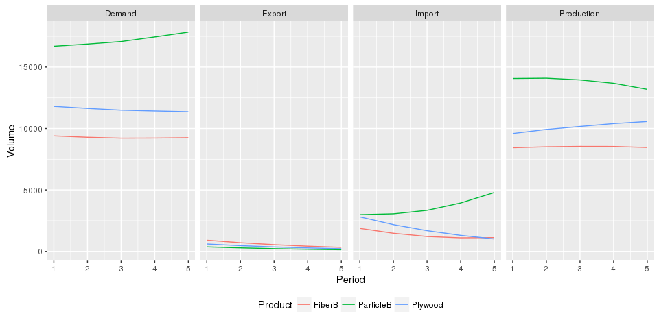

# Explore GFPM data
Paul Rougieux  


```r
library(GFPMoutput)
library(knitr)
library(dplyr)
library(ggplot2)
library(scales)
```


# Load scenario data
If you created a scenario with the `load_and_clean_gfpm_data()` function,  your scenario will be stored in the `enddata` folder.
The data object used for demonstration purposes is called `trainingscenarios`.
It is a list of data frames. 

```r
basescenario <- readRDS("enddata/basescenario.rds")
trainingscenarios <- readRDS("enddata/GFPM_training_scenarios.rds")
```
To bind several scenarios together in one list,
use the `bindscenarios()` function.


## What is the structure of "trainingscenarios"
`trainingscenarios` is a list of data frames:

 * scenario data frame contains scenario names and file names
 * entity data frame contains the Supply, DPrice, Import, Demand, Export and Production data at the country level
 * aggregates contains the Supply, DPrice, Import, Demand, Export and Production at the regional level
 * worldPrices contains the world prices
 

```r
str(trainingscenarios)
```

```
## List of 4
##  $ scenario   :'data.frame':	4 obs. of  2 variables:
##   ..$ scenario_name: Factor w/ 4 levels "Base","BaseLowElast",..: 1 2 3 4
##   ..$ fileName     : Factor w/ 4 levels "PELPS 105Base.RDATA",..: 1 2 3 4
##  $ entity     :'data.frame':	312492 obs. of  9 variables:
##   ..$ Product_Code: int [1:312492] 80 80 80 80 80 80 80 80 80 80 ...
##   ..$ Product     : chr [1:312492] "Fuelwood" "Fuelwood" "Fuelwood" "Fuelwood" ...
##   ..$ Country_Code: chr [1:312492] "a0" "r6" "i9" "e3" ...
##   ..$ Country     : chr [1:312492] "Algeria" "Tajikistan" "Brunei Darussalam" "Tanzania, United Rep of" ...
##   ..$ GFPM_REG    : Ord.factor w/ 7 levels "Africa"<"North/Central America"<..: 1 4 4 1 4 6 1 4 1 5 ...
##   ..$ Period      : int [1:312492] 5 1 5 1 5 3 1 5 1 4 ...
##   ..$ Volume      : num [1:312492] 6050.8 61 50.8 22831 1.1 ...
##   ..$ Element     : chr [1:312492] "Supply" "DPrice" "DPrice" "Supply" ...
##   ..$ Scenario    : chr [1:312492] "Base" "Base" "Base" "Base" ...
##  $ aggregates :'data.frame':	14652 obs. of  6 variables:
##   ..$ Product : chr [1:14652] "FiberB" "Fuelwood" "Newsprint" "OthIndRound" ...
##   ..$ Element : chr [1:14652] "Demand" "Demand" "Demand" "Demand" ...
##   ..$ GFPM_REG: Ord.factor w/ 7 levels "Africa"<"North/Central America"<..: 1 1 1 1 1 1 1 1 1 1 ...
##   ..$ Period  : int [1:14652] 1 1 1 1 1 1 1 1 1 1 ...
##   ..$ Volume  : num [1:14652] 905 614965 933 28635 4250 ...
##   ..$ Scenario: chr [1:14652] "Base" "Base" "Base" "Base" ...
##  $ worldPrices:'data.frame':	468 obs. of  5 variables:
##   ..$ Product_Code: int [1:468] 80 80 80 80 80 81 81 81 81 81 ...
##   ..$ Product     : chr [1:468] "Fuelwood" "Fuelwood" "Fuelwood" "Fuelwood" ...
##   ..$ Period      : int [1:468] 4 1 2 3 5 3 1 2 4 5 ...
##   ..$ World_Price : num [1:468] 57.6 61 59.9 58.8 56.3 97.2 99 98.1 95.7 94.1 ...
##   ..$ Scenario    : chr [1:468] "Base" "Base" "Base" "Base" ...
```

You can extract individual data frames with the command:

```r
countrydata <- trainingscenarios$entity 
regiondata <- trainingscenarios$aggregates 
```


## How many periods are there per scenario?

```r
trainingscenarios$aggregates %>% group_by(Scenario) %>% 
    summarise(number_of_periods = max(Period)) %>% kable()
```


|Scenario      | number_of_periods|
|:-------------|-----------------:|
|Base          |                 5|
|Base2011      |                21|
|BaseHighElast |                 5|
|BaseLowElast  |                 5|

```r
# Remove periods for base2011 so that all scenarios have the same periods for plotting
trainingscenarios$aggregates <- trainingscenarios$aggregates %>%
    filter(Period <= 5)
trainingscenarios$entity <- trainingscenarios$entity %>%
    filter(Period <= 5)
```


## What products are demanded, supplied, produced or traded ?

* IndRound is supplied and traded but not demanded, it's a primary product.
* OthFbrPlp and WastePaper are supplied and traded but not demanded, they are primary products.
* Fuelwood is both supplied and demanded it's both a primary and a final product.
* Fuelwood is not the outcome of a production process.


```r
trainingscenarios$entity %>% group_by(Element) %>%
    summarise(Products = paste(unique(Product),collapse=", ")) %>% kable()
```


|Element    |Products                                                                                                                           |
|:----------|:----------------------------------------------------------------------------------------------------------------------------------|
|Demand     |Fuelwood, OthIndRound, Sawnwood, Plywood, ParticleB, FiberB, MechPlp, ChemPlp, WastePaper, Newsprint, PWPaper, OthPaper, OthFbrPlp |
|DPrice     |Fuelwood, OthIndRound, Sawnwood, Plywood, ParticleB, FiberB, MechPlp, ChemPlp, WastePaper, Newsprint, PWPaper, OthPaper, OthFbrPlp |
|Export     |Fuelwood, IndRound, Sawnwood, Plywood, ParticleB, FiberB, MechPlp, ChemPlp, OthFbrPlp, WastePaper, Newsprint, PWPaper, OthPaper    |
|Import     |Fuelwood, IndRound, Sawnwood, Plywood, ParticleB, FiberB, MechPlp, ChemPlp, OthFbrPlp, WastePaper, Newsprint, PWPaper, OthPaper    |
|Production |Sawnwood, Plywood, ParticleB, FiberB, MechPlp, ChemPlp, Newsprint, PWPaper, OthPaper                                               |
|Supply     |Fuelwood, IndRound, OthIndRound, OthFbrPlp, WastePaper, MechPlp, OthPaper                                                          |

## What countries are in the simulation?

```r
countries <- sort(unique(trainingscenarios$entity$Country))
# Convert to utf8 because of character encoding issue
cat(iconv(countries,"latin1","UTF-8"),sep= ", ")
```

Afghanistan, Albania, Algeria, Angola, Argentina, Armenia, Australia, Austria, Azerbaijan, Republic of, Bahamas, Bahrain, Bangladesh, Barbados, Belarus, Belgium, Belize, Benin, Bhutan, Bolivia, Bosnia and Herzegovina, Botswana, Brazil, Brunei Darussalam, Bulgaria, Burkina Faso, Burundi, Cambodia, Cameroon, Canada, Cape Verde, Central African Republic, Chad, Chile, China, Colombia, Congo, Dem Republic of, Congo, Republic of, Cook Islands, Costa Rica, Croatia, Côte d'Ivoire, Cuba, Cyprus, Czech Republic, Denmark, Djibouti, Dominica, Dominican Republic, Ecuador, Egypt, El Salvador, Equatorial Guinea, Estonia, Ethiopia, Fiji Islands, Finland, France, French Guiana, French Polynesia, Gabon, Gambia, Georgia, Germany, Ghana, Greece, Guatemala, Guinea, Guinea-Bissau, Guyana, Haiti, Honduras, Hungary, India, Indonesia, Iran, Islamic Rep of, Iraq, Ireland, Israel, Italy, Jamaica, Japan, Jordan, Kazakhstan, Kenya, Korea, Dem People's Rep, Korea, Republic of, Kuwait, Kyrgyzstan, Laos, Latvia, Lebanon, Lesotho, Liberia, Libyan Arab Jamahiriya, Lithuania, Luxembourg, Macedonia,The Fmr Yug Rp, Madagascar, Malawi, Malaysia, Maldives, Mali, Martinique, Mauritania, Mauritius, Mexico, Moldova, Republic of, Mongolia, Montenegro, Morocco, Mozambique, Myanmar, Nepal, Netherlands, Netherlands Antilles, New Caledonia, New Zealand, Nicaragua, Niger, Nigeria, Norway, Oman, Pakistan, Panama, Papua New Guinea, Paraguay, Peru, Philippines, Poland, Portugal, Qatar, Romania, Réunion, Russian Federation, Rwanda, Saint Lucia, Saint Vincent/Grenadines, Samoa, Sao Tome and Principe, Saudi Arabia, Senegal, Serbia, Sierra Leone, Singapore, Slovakia, Slovenia, Solomon Islands, Somalia, South Africa, Spain, Sri Lanka, Sudan, Suriname, Swaziland, Sweden, Switzerland, Syrian Arab Republic, Tajikistan, Tanzania, United Rep of, Thailand, Timor-Leste, Togo, Tonga, Trinidad and Tobago, Tunisia, Turkey, Turkmenistan, Uganda, Ukraine, United Arab Emirates, United Kingdom, United States of America, Uruguay, Uzbekistan, Vanuatu, Venezuela, Boliv Rep of, Viet Nam, Yemen, Zambia, Zimbabwe


# Plots
## Plot by region

```r
plotprodbyreg(trainingscenarios, "Sawnwood", "Base")
```

<!-- -->


```r
plotprodbyreg(trainingscenarios, "IndRound", "Base")
```

<!-- -->


## Plot by country 
Sample plot for Sanwood demand in the base scenario, in France and Germany.

```r
plotprodbycounty(trainingscenarios, "Sawnwood", "Base",
                 c("France", "Germany"))
```

<!-- -->

The above function generates a plot based on the given arguments.
For greater flexibility you are encouraged to read about 
[ggplot2 package](ggplot2.org). 
Here is an example plot showing 
demand, export, import and production of selected panel products 
in the United States in the base scenario.


```r
usademand <- trainingscenarios$entity %>% 
    filter(Country == "United States of America" & 
               Element %in% c("Demand", "Production",
                              "Import", "Export") &
               Product %in% c("ParticleB", "FiberB","Plywood") &
               Scenario == "Base")

ggplot(data=usademand) +
    aes(x=Period, y=Volume, colour=Product) +
    geom_line() + 
    theme(legend.position = "bottom") +
    facet_grid(~ Element) 
```

<!-- -->
Example of a description for this graph. 
The base scenario simulated 
a decrease in particle board production 
and an increase in demand over the 5 periods. 
The increased particle board demand was compensated by increases in imports. On the other hand fibre board and plywood import decreased over the period.

## Compare scenarios
Two training scenarios where calculated by changing the demand
elasticities by plus or minus 1 standard error, corresponding to a 
confidence intereval of 70%.

```r
sawnwood <- subset(trainingscenarios$aggregates, Product=="Sawnwood"& Element=="Demand")
ggplot(data = sawnwood) +
    aes(x = Period, y = Volume, colour = GFPM_REG, linetype = Scenario) +
    geom_line() + ggtitle("Sawnwood Demand") +
    theme(legend.position = "bottom")
```

<!-- -->

Compare for all products

```r
paperproducts <- subset(trainingscenarios$aggregates, Element=="Demand" & 
                  ! Product %in% c("MechPlp", "ChemPlp", "WastePaper"))
ggplot(data = paperproducts) +
    aes(x = Period, y = Volume, colour = GFPM_REG, linetype = Scenario) +
    geom_line() + ggtitle("Demand") +
    theme(legend.position = "bottom") + facet_wrap(~Product, scales="free_y")
```

<!-- -->

